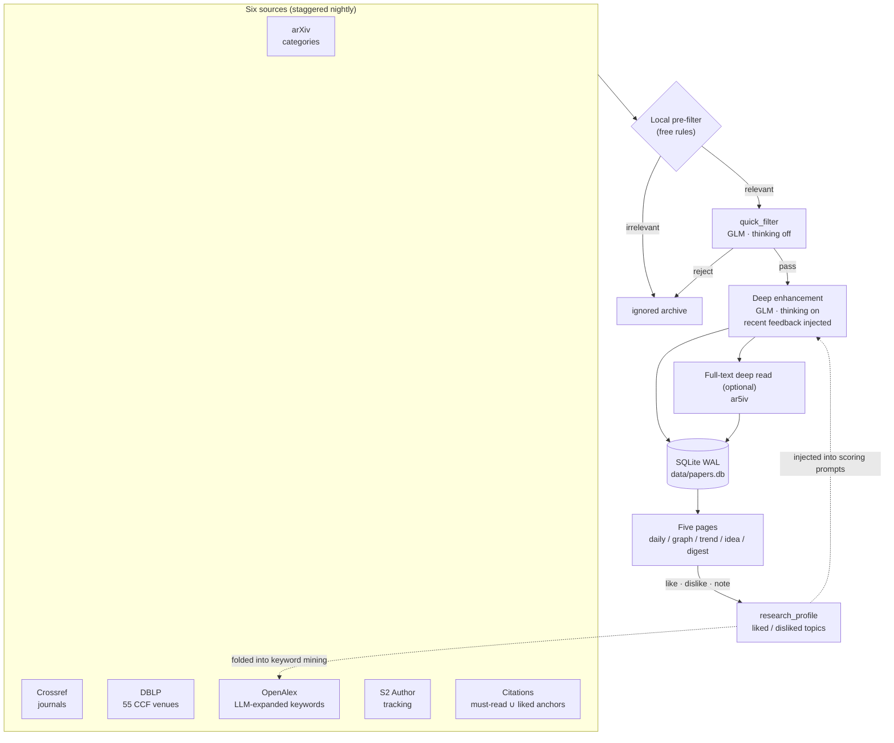

<div align="center">

# 📡 arXiv Daily Dispatch

**arxivSCI-daily · Personalized Research Intelligence Daemon**

[](README.md)


-3859FF)


A self-hosted research literature intelligence station: six discovery sources
are crawled automatically every night, a tiered LLM pipeline filters and deeply
annotates them in Chinese, your likes / dislikes / notes feed back into scoring
and retrieval, and a weekly/monthly trend radar plus knowledge graph show you
what is happening in your field.

</div>

---

## ✨ Highlights

- **Six discovery sources** — arXiv category subscriptions, Crossref journals, DBLP (55 CCF venues), OpenAlex keyword search (LLM-expanded to 40–90 queries), Semantic Scholar author tracking, and citation tracing (anchors = must-read ∪ liked papers)
- **Tiered AI pipeline** — free local pre-filter → GLM quick filter (thinking off) → deep enhancement (thinking on: Chinese TLDR, motivation/method/result breakdown, relevance × quality scores, four-level recommendation with reasons) → optional full-text deep reading (ar5iv, budget-capped)
- **Feedback loop** — like/dislike/note on any paper; notes are academicized and distilled into liked/disliked topics that are injected into scoring prompts and keyword mining. The system learns your direction as you use it
- **Trend radar** — weekly/monthly Chinese trend reports (emerging methods, opportunities, field migration) with a browsable archive
- **Knowledge graph** — knowledge cards clustered with a d3 force layout, L1/L2/L3 level navigation
- **Idea workbench** — submit a research idea; the AI retrieves prior work and analyzes differentiation
- **Daily digest** — auto-generated markdown briefing with GFM tables and a morning-reading preset
- **Self-hosted & single-machine** — Flask + SQLite (WAL), no external services; crawl schedule, staggering and rotation are configurable in the web UI with instant triggers

## 🧠 Pipeline



## 🖥 Frontend

| Page | Features |
|:-----|:-----|
| Daily papers | three-level cards, four-level recommendation labels, morning-reading / must-read / starred presets, side-by-side compare, batch BibTeX export, ignored-papers review, code links |
| Knowledge graph | knowledge cards, d3 force clustering, L1/L2/L3 navigation |
| Trend radar | weekly/monthly reports + historical archive |
| Idea workbench | submit an idea → AI retrieves prior work and analyzes differentiation |
| Daily digest | markdown briefing rendered with GFM tables |

Also: grouped sidebar filters + search + 7 sort orders, CCF catalog labels
(130+ venues / 80+ journals), 4 themes, keyboard shortcuts (`j`/`k`, `f`, `/`, `?`),
a settings panel (schedule / staggering / rotation + instant triggers), and the
LLM provider — GLM (coding plan or pay-as-you-go), DeepSeek, or any
OpenAI-compatible endpoint — can be switched right in the web UI: validated
first, written back to `backend/ai/.env`, applied without a restart, with per-provider
key memory.

## 🚀 Quick Start

```bash
git clone https://github.com/CHGeronimo/arxivSCI-daily.git
cd arxivSCI-daily
pip install -r requirements.txt

cp backend/ai/.env.example backend/ai/.env
# edit backend/ai/.env with your GLM API key (free at https://open.bigmodel.cn)

python3 daemon.py --port 8080
# open http://localhost:8080
```

Personal runtime files (`research_profile.json`, `subscriptions.json`,
`data/papers.db`) are auto-generated on first run and never committed.

## 🔌 API (52 endpoints)

Full list in `api.py` — papers (paginated, up to 50k lightweight), subscriptions
& profile, field-level feedback with note academicization, manual triggers for
every job, jobs/stats observability, weekly/monthly trend radars, BibTeX export,
daily digests, provider switching (GLM / DeepSeek / custom OpenAI-compatible),
per-task model overrides for 10 pipeline tasks, masked LLM-key management, and
listen host/port configuration (applied on daemon restart).

## 🧪 Tests

```bash
for t in tests/test_*.py; do LOG_DIR=/tmp python3 "$t"; done
```

25 regression scripts, fully mocked (no API quota consumed).

## 📄 License & Citation

MIT — see [LICENSE](LICENSE). If this helps your research, cite via the
"Cite this repository" button (powered by [CITATION.cff](CITATION.cff)).

## 🙏 Acknowledgments

The initial architecture (arXiv crawling + AI summaries + web display) was
inspired by [dw-dengwei/daily-arXiv-ai-enhanced](https://github.com/dw-dengwei/daily-arXiv-ai-enhanced).
The current version is a complete rebuild: Flask daemon + SQLite storage, six
discovery sources, citation tracing, the scoring/feedback loop, trend radar,
knowledge graph and full-text deep reading are all original implementations.
See the [Chinese README](README.md) for full documentation.
