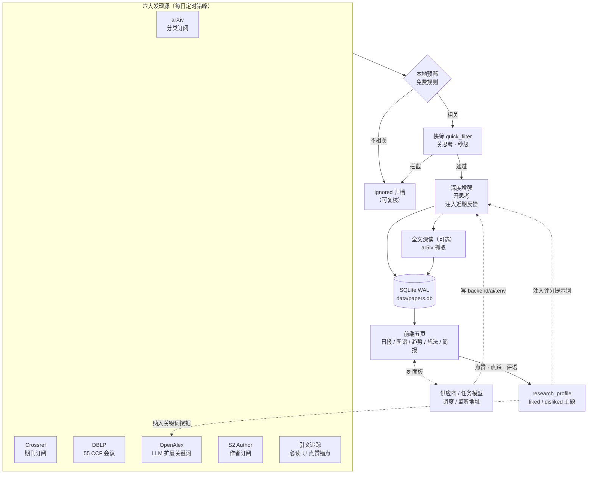

<div align="center">

# 📡 arXiv 每日电讯

**arxivSCI-daily · Personalized Research Intelligence Daemon**

[](README.en.md)


多源聚合 · AI 深读 · 反馈闭环 · 趋势雷达 · 知识图谱 · 前端全配置

一个自托管的个人研究文献智能调度站：六大发现源每日定时自动汇集论文，
分级 LLM 流水线完成相关性快筛与深度解读，你的点赞/点踩/评语持续回流影响后续评分与检索，
趋势雷达与知识图谱帮你看见领域正在发生什么——AI 供应商、逐任务模型、调度、监听地址
全部可以在网页设置面板里改，改完即生效。

</div>

---

## ✨ 核心特性

### 🔎 发现：六大来源，每天自动错峰

- **arXiv** 分类订阅（停机 ≥2 天自动按提交日期区间回补断档）
- **Crossref** 期刊订阅（Nature 系列等，仅保留 research 类型）
- **DBLP** 55 个 CCF 会议（轮换覆盖）
- **OpenAlex** 关键词搜索——LLM 两阶段把研究方向扩展为 40–90 条检索查询（概念穷举 + 缩写/全称/子方向变体），liked 主题纳入挖掘、disliked 主题排除
- **Semantic Scholar** 作者订阅（姓名 / ORCID 辅助查找）
- **引文顺藤摸瓜**：以「必读 ∪ 点赞」论文为锚点追引用与被引（锚点轮换，OpenAlex 免费额度）

### 🧠 分级 AI 流水线（省钱且保质）

```
本地规则预筛（零 token）→ 快筛 quick_filter（关思考，秒级）
  → 深度增强（开思考：中文 TLDR/motivation/method/result/conclusion、
    相关度×质量双评分、必读/推荐/参考/忽略四级推荐理由）
  → 全文深读（可选，ar5iv 抓取全文再分析，预算可控，低信息量自动标记）
```

- **按任务模型**：10 类任务（快筛/关键词/主题/聚类/增强/全文/趋势/简报/知识卡片/想法查重）可各自指定模型——快筛用 flash 省配额、全文用最强模型，留空跟随默认
- **GLM 专属思考开关自适应**：`thinking` 参数只在 GLM 端点发送，DeepSeek 等 OpenAI 兼容端点自动跳过
- **全局速率限制**：并发信号量 + 最小间隔 + 429/1302 指数退避

### 🔁 反馈闭环：越用越懂你

- 每篇论文可 **点赞 / 点踩 / 写评语**，评语自动**学术化改写**后沉淀为 liked/disliked 主题
- 主题注入后续**评分提示词**与**关键词挖掘**，近期的评语原文以最高优先级进入评分上下文
- 主题库带 LLM 语义去重（带保底守卫，绝不清空）；评分与反馈的混淆矩阵可审计

### 📊 前端五页

| 页面 | 功能 |
|:-----|:-----|
| 论文日报 | 卡片三级层次（标题→TLDR→元信息）、四级推荐标签与推荐理由、晨读/必读/收藏预设、论文对比视图、BibTeX 批量导出、忽略论文复核、代码链接 |
| 知识图谱 | 知识卡片 d3 力导向聚类，L1/L2/L3 层级导航 |
| 趋势雷达 | 周/月双粒度中文报告（新方法涌现/机会点/领域迁移）+ 历史归档回看 |
| 研究想法 | 提交 idea → AI 检索已有工作、分析差异化与可行性 |
| 今日简报 | 每日 digest Markdown 渲染（GFM 表格、链接协议白名单），晨读预设一键过滤；页内「生成今日简报」按钮一键生成/重生成，完成后自动加载 |

通用：侧边栏分组筛选（来源/会议/期刊/领域/推荐/收藏）+ 搜索 + 7 种排序、
CCF 第七版分级标签（130+ 会议 / 80+ 期刊，A/B/C 彩色标识）、
4 套主题（深色/浅色/学术/暖色）、键盘快捷键（`j`/`k` 翻页、`f` 收藏、`/` 搜索、`?` 帮助）、
骨架屏加载、运行版本可观测（页面版本 vs 磁盘代码一致性提示）。

### 🎛 前端设置面板——不用碰服务器

⚙️ 菜单里的设置面板覆盖了几乎所有运行配置，分四块：

| 板块 | 能改什么 | 生效方式 |
|:-----|:---------|:---------|
| 抓取调度 | 每日起始小时（0-23 任意时段）、任务错峰间隔、启动即跑、DBLP/S2 轮换天数、本地预筛开关 | 保存即重排时间表 |
| 🔑 AI 供应商 | GLM Coding Plan / GLM 按量 / DeepSeek / 自定义 OpenAI 兼容端点；先用新配置实测一次再落盘，各供应商 Key 分别记忆（切回免重填）；切换时自动清理指向旧供应商的按任务模型覆盖 | 即时生效，无需重启 |
| 🎛 任务模型 | 默认模型 + 10 类任务逐个覆盖（留空跟随默认），带当前供应商的模型建议下拉 | 即时生效，无需重启 |
| 🌐 监听地址 | 绑定 IP（127.0.0.1 仅本机 / 0.0.0.0 局域网 / 具体 IPv4）与端口，选 0.0.0.0 有安全警告 | 重启 daemon 生效（面板显示「⟳ 待重启」） |

顶栏功能按职责分为三个入口，互不掺杂：

- **🔄 手动抓取**：五个数据源逐个触发（带状态计数）或全部抓取，不受凌晨窗口限制
- **🤖 AI 处理**：补 AI 增强 / 知识卡片提取 / 重跑图谱聚类 / 补全文分析
- **⚙️ 系统设置**：上述四块配置 + **🧪 系统自检**——21 项轻量冒烟（六个网络源各 1 条请求 + **全部 10 类 LLM 任务逐条真实链路冒烟**：快筛/关键词/评语学术化/聚类/评分/知识卡片/全文深读/趋势/简报/想法查重 + SQLite/调度/版本一致性/前端资源），分组弹窗展示 ✓/⚠/✗ 与耗时，绝不触发全量爬取

## 🧠 系统流水线



## 🚀 Quick Start

```bash
git clone https://github.com/CHGeronimo/arxivSCI-daily.git
cd arxivSCI-daily
pip install -r requirements.txt

cp backend/ai/.env.example backend/ai/.env
# 编辑 backend/ai/.env，填入 GLM API Key（https://open.bigmodel.cn 免费申请）
# （也可以先随便填，启动后在 ⚙️ 设置面板里粘贴 Key 验证保存）

python3 daemon.py --port 8080
# 打开 http://localhost:8080
```

- 首次启动自动迁移历史 JSONL 数据到 SQLite，无需手动操作
- 在「🎯 研究方向」中填写方向描述 → 一键 LLM 提取关键词；在「📡 订阅」中勾选 arXiv 分类 / 期刊 / 会议 / 作者
- 默认每天 2:00 起每 30 分钟错峰一个任务（起始小时 NIGHT_START 可设 0-23 任意时段，前端可改），手动触发不受限制
- 监听地址：`--host/--port` 命令行参数 > 面板设置（DAEMON_HOST/DAEMON_PORT）> 默认 127.0.0.1:8080

## ⚙️ 配置

| 文件 | 说明 |
|:-----|:-----|
| `backend/ai/.env` | API Key / endpoint / 模型名 / 供应商 / 任务模型 / 监听地址（**gitignored**；⚙️ 面板可直接改大部分项） |
| `research_profile.json` | 研究方向 + 关键词 + liked/disliked 主题（反馈沉淀，**自动生成，gitignored**） |
| `subscriptions.json` | 订阅配置（arXiv 分类 / 期刊 / 会议 / 作者 / 搜索关键词，**自动生成，gitignored**） |
| `data/papers.db` | SQLite 数据库（自动创建 + 迁移，gitignored） |

个人运行时数据（研究画像、订阅、反馈、数据库）均不入库，仓库中只含代码与文档。
`.env` 中的每一项都有注释说明（见 [backend/ai/.env.example](backend/ai/.env.example)）：
思考强度全局开关、AI 并行数、本地预筛、引文追踪锚点数、按任务模型覆盖等。

## 🗄 存储层

SQLite（WAL 模式，并发读写安全），11 张表覆盖论文、AI 结果、反馈、书签、简报、
趋势报告、忽略池、知识卡片、运行时设置等。关键设计：

- **批量写队列**：后台线程每 50 条或 100ms 刷盘，爬虫不阻塞
- **自动迁移**：启动时检测旧 JSONL 数据自动导入
- **常用索引**：source / published_date / recommendation / relevance_score
- **运行时设置 KV**：环境变量之上叠加，前端保存即写库，60s 缓存 + 调度器自动重排

## 🔌 API（53 个端点）

主要资源（完整列表见 `backend/api.py`）：

| 分组 | 端点示例 |
|:-----|:-----|
| 论文 | `GET /api/papers`（分页/筛选/排序，最高 5 万条轻量模式）、`GET /api/paper/<id>`（全文深读） |
| 订阅与画像 | `GET/PUT /api/subscriptions`、`GET/PUT /api/profile`（PUT 合并保存）、`POST /api/extract-keywords`、`GET /api/author/search` |
| 反馈 | `POST /api/feedback`（字段级更新）、书签/已读、评语学术化改写、主题提取与去重 |
| AI 配置 | `GET/PUT /api/llm-config`（供应商切换，验证→写 .env→即时生效）、`GET/PUT /api/llm-models`（10 类任务逐个模型）、`GET/PUT /api/llm-key`（Key 修改，只回脱敏掩码） |
| 触发与观测 | `POST /api/trigger/<job>`（6 源 + 增强 + 知识提取 + 趋势 + 简报 + 自检）、`GET /api/jobs`（含计划时间）、`GET /api/selftest`（自检报告）、`GET /api/stats`（含版本一致性）、`GET/PUT /api/bind`（监听地址） |
| 趋势与导出 | `GET /api/trend-radars`（周/月 + 历史）、`POST /api/export/bibtex`、`GET /api/digest/<date>`、`GET /api/digests` |

## 🧪 测试与运维

```bash
# 27 个回归测试（全部 Mock LLM，不消耗 API 配额）
for t in tests/test_*.py; do LOG_DIR=/tmp python3 "$t"; done

# 发现质量审计：漏斗结构 / 评分×反馈混淆矩阵 / 引文锚点池
python3 scripts/audit_discovery.py --sample 20

# 其他运维脚本：backfill_code_urls（代码链接回填）· clean_topics（主题清理）
#               · verify_feedback_loop（反馈闭环校验）
```

工程细节：

- **OpenAlex 计费时代适配**：共享节流客户端（全局最小间隔）；429 时读响应体区分「余额真熔断」（暂停到 UTC 重置）与「Cloudflare 抖动」（短退避重试）
- **爬取层去重**：已入库/已忽略的 DOI 直接跳过，不为已知论文烧 OpenAlex 配额
- **任务互斥网关**：同一时刻只跑一个重任务，冲突自动顺延，避免夜间风暴
- **供应商切换自愈**：切换 AI 供应商时自动清理指向旧供应商的按任务模型覆盖
- **静态目录黑名单**：`backend/` `scripts/` `tests/` `data/` 整目录 403，源码与数据不可被下载

## 📁 项目结构

```
├── daemon.py               # 入口薄壳（python daemon.py 用法不变），主体在 backend/
├── backend/                # 后端 Python 包
│   ├── daemon.py           #   入口主体：绑定解析 + app factory + Scheduler
│   ├── api.py              #   Flask 路由（53 端点）
│   ├── db.py               #   SQLite + 写队列 + schema/迁移 + 运行时设置
│   ├── jobs.py             #   BaseCrawlerJob + 凌晨错峰调度器（replan 热生效）
│   ├── paper_store.py      #   SQLite CRUD
│   ├── ccf_map.py          #   CCF 目录映射
│   ├── ai/                 #   LLM 工厂(限流+task_model) / 快筛 / 增强 / 全文深读 /
│   │                       #   关键词扩展 / 趋势 / 知识聚类 / 简报 / idea 检查
│   └── crawler/            #   六大发现源爬虫
├── web/                    # 前端（SPA）
│   ├── index.html  js/  css/(4主题)  vendor/
├── scripts/                # 审计 / 回填 / 主题清理 / 反馈闭环验证 / 一次性迁移
├── tests/                  # 27 个回归测试
└── docs/                   # 设计文档
```

## 🧭 设计决策与已知限制

- `subscriptions` 表建而不用：单用户场景下 JSON（原子写 + 并发锁 + git 版本化）无实际痛点，迁移只引入风险；表结构已就绪，多人共享需求出现时再迁移
- S2 Author API 无 key 时会限流（仅影响作者订阅频率，重试+退避兜底）
- DBLP 论文摘要依赖 OpenAlex 回填，部分论文可能缺摘要
- 监听 `0.0.0.0` 会把服务（含 AI 配置接口）暴露给局域网，公用网络慎用
- 通知推送（邮件/微信/Telegram）在 Roadmap 中，UI 预留入口

## 🗺 Roadmap

- [ ] 通知推送（邮件 / 微信 / Telegram）
- [ ] 非 arXiv 论文全文（Unpaywall PDF）
- [ ] Related-work 草稿生成（基于收藏与必读集）
- [ ] 阅读统计面板
- [ ] Semantic Scholar API key 二级源

## 📄 许可与引用

MIT — 见 [LICENSE](LICENSE)。如对研究有帮助，可通过仓库页「Cite this repository」按钮一键引用（[CITATION.cff](CITATION.cff)）。

## 🙏 致谢与衍生说明

本项目初始架构（arXiv 抓取 + AI 中文摘要 + 网页展示）的灵感来自
[dw-dengwei/daily-arXiv-ai-enhanced](https://github.com/dw-dengwei/daily-arXiv-ai-enhanced)，在此致谢。
当前版本已在其思路上完全重构与扩展：Flask 守护进程 + SQLite 存储、六大发现源、引文顺藤摸瓜、
AI 评分与用户反馈闭环、周/月趋势雷达、知识图谱聚类、全文深读、前端全配置等均为本项目的独立实现。
