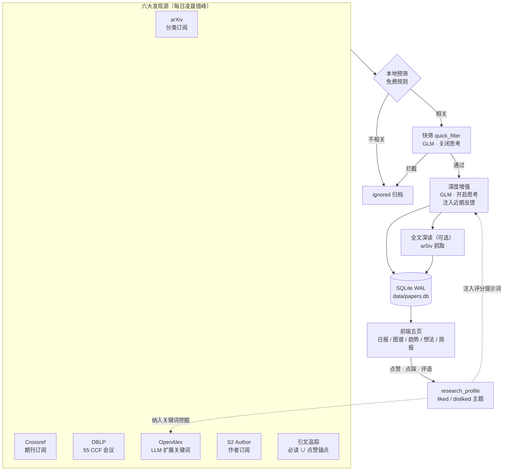

<div align="center">

# 📡 arXiv 每日电讯

**arxivSCI-daily · Personalized Research Intelligence Daemon**


-3859FF)


多源聚合 · AI 深读 · 反馈闭环 · 趋势雷达 · 知识图谱

一个自托管的个人研究文献智能调度站：六大发现源每日凌晨自动汇集论文，
LLM 流水线完成相关性快筛与深度解读，你的点赞/点踩/评语持续回流影响后续评分与检索，
趋势雷达与知识图谱帮你看见领域正在发生什么。

</div>

---

## ✨ 核心特性

- **六大发现源**：arXiv 分类订阅、Crossref 期刊、DBLP（55 个 CCF 会议）、OpenAlex 关键词搜索（LLM 两阶段扩展到 40–90 条查询）、Semantic Scholar 作者订阅、引文顺藤摸瓜（以必读 ∪ 点赞论文为锚点追引用/被引）
- **分级 AI 流水线**：本地规则预筛（免费）→ GLM 快筛（关闭思考，省时）→ 深度增强（开启思考：中文解读、TLDR、方法/结果拆解、相关度×质量双评分、四级推荐理由）→ 可选全文深读（ar5iv 抓取，预算可控）
- **反馈闭环**：每篇论文可点赞/点踩/写评语；评语自动学术化改写并沉淀为 liked/disliked 主题，注入后续评分提示词与关键词挖掘——系统越用越懂你的方向
- **趋势雷达**：周/月双粒度中文趋势报告（新方法涌现、机会点、领域迁移），历史归档随时回看
- **知识图谱**：论文知识卡片 d3 力导向聚类，L1/L2/L3 层级导航
- **研究想法工作台**：提交 idea，AI 检索已有论文并分析差异化与可行性
- **今日简报**：每日 digest 自动生成，GFM 表格渲染，晨读预设一键过滤
- **自托管 & 单机部署**：Flask + SQLite（WAL），无外部服务依赖；抓取调度、错峰间隔、轮换周期均可在前端设置面板调整并立即触发

## 🧠 系统流水线



## 🖥 前端一览

| 页面 | 功能 |
|:-----|:-----|
| 论文日报 | 卡片三级层次（标题→TLDR→元信息）、四级推荐标签、晨读/必读/收藏预设、论文对比视图、BibTeX 批量导出、忽略论文复核、代码链接 |
| 知识图谱 | 知识卡片 d3 力导向聚类，L1/L2/L3 层级导航入口 |
| 趋势雷达 | 周/月双粒度报告切换 + 历史归档回看 |
| 研究想法 | idea 提交 → AI 检索已有工作、分析差异化 |
| 今日简报 | 每日 digest Markdown 渲染（GFM 表格、链接协议白名单） |

通用：侧边栏分组筛选 + 搜索 + 7 种排序、CCF 第七版分级标签（130+ 会议 / 80+ 期刊）、
4 套主题（深色/浅色/学术/暖色）、键盘快捷键（`j`/`k` 翻页、`f` 收藏、`/` 搜索、`?` 帮助）、
抓取设置面板（调度时间/错峰/轮换 + 立即触发）、运行版本可观测。

## 🚀 Quick Start

```bash
git clone https://github.com/CHGeronimo/arXiv-.git
cd arXiv-
pip install -r requirements.txt

cp ai/.env.example ai/.env
# 编辑 ai/.env，填入 GLM API Key（https://open.bigmodel.cn 免费申请）

python3 daemon.py --port 8080
# 打开 http://localhost:8080
```

- 首次启动自动迁移历史 JSONL 数据到 SQLite，无需手动操作
- 在「🎯 研究方向」中填写方向描述 → 一键 LLM 提取关键词；在「📡 订阅」中勾选 arXiv 分类 / 期刊 / 会议 / 作者
- 默认每天凌晨 2:00 起错峰执行（`NIGHT_START` / `STAGGER_MINUTES` 可调，前端设置面板可改），UI/API 手动触发不受时间限制

## ⚙️ 配置

| 文件 | 说明 |
|:-----|:-----|
| `ai/.env` | GLM API Key / endpoint / 模型名（**gitignored**） |
| `research_profile.json` | 研究方向 + 关键词 + liked/disliked 主题（反馈沉淀，**自动生成，gitignored**） |
| `subscriptions.json` | 订阅配置（arXiv 分类 / 期刊 / 会议 / 作者 / 搜索关键词，**自动生成，gitignored**） |
| `data/papers.db` | SQLite 数据库（自动创建 + 迁移，gitignored） |

个人运行时数据（研究画像、订阅、反馈、数据库）均不入库，仓库中只含代码与文档。

运行时设置（凌晨起始小时、错峰分钟、启动即跑、DBLP/OpenAlex 轮换天数、本地预筛开关）
支持环境变量与前端设置面板双通道，热生效（调度器自动重排）。

## 🗄 存储层

SQLite（WAL 模式，并发读写安全），11 张表覆盖论文、AI 结果、反馈、书签、简报、趋势报告、忽略池、知识卡片等。
关键设计：

- **批量写队列**：后台线程每 50 条或 100ms 刷盘，爬虫不阻塞
- **自动迁移**：启动时检测旧 JSONL 数据自动导入
- **常用索引**：source / published_date / recommendation / relevance_score

## 🔌 API（44 个端点）

主要资源（完整列表见 `api.py`）：

| 分组 | 端点示例 |
|:-----|:-----|
| 论文 | `GET /api/papers`（分页/筛选/排序，最高 5 万条轻量模式）、`GET /api/paper/<id>`（全文深读） |
| 订阅与画像 | `GET/PUT /api/subscriptions`、`GET/PUT /api/profile`（PUT 合并保存）、`POST /api/extract-keywords` |
| 反馈 | `POST /api/feedback`（字段级更新）、书签/已读、`POST /api/feedback/note`（评语学术化） |
| 触发与观测 | `POST /api/trigger/<job>`（6 源 + 增强 + 知识提取 + 趋势 + 简报）、`GET /api/jobs`、`GET /api/stats`（含版本一致性） |
| 趋势与导出 | `GET /api/trend-radars`（周/月）、`POST /api/export/bibtex`、`GET /api/digest/<date>` |

## 🧪 测试与运维

```bash
# 21 个回归测试（Mock LLM，不消耗 API 配额）
for t in tests/test_*.py; do python3 "$t"; done

# 发现质量审计：漏斗结构 / 评分×反馈混淆矩阵 / 引文锚点池
python3 scripts/audit_discovery.py --sample 20

# 其他：scripts/backfill_code_urls.py · clean_topics.py · verify_feedback_loop.py
```

工程细节：OpenAlex 共享节流客户端（全局最小间隔 + 429 退避，区分"余额熔断"与"Cloudflare 抖动"）；
GLM 全局速率限制（并发信号量 + 间隔 + 指数退避）；arXiv 停机 ≥2 天自动按提交日期区间回补。

## 📁 项目结构

```
├── daemon.py                # 入口：argparse + app factory + Scheduler
├── api.py                   # Flask 路由（44 端点）
├── db.py                    # SQLite + 写队列 + schema/迁移 + 运行时设置
├── jobs.py                  # BaseCrawlerJob + 凌晨错峰调度器（replan 热生效）
├── paper_store.py           # SQLite CRUD
├── crawler/                 # 6 个爬虫 + models + subs_store
├── ai/                      # LLM 工厂(限流) / 快筛 / 增强 / 全文抓取+深读 /
│                            # 关键词扩展 / 趋势分析 / 知识聚类 / 简报 / idea 检查
├── js/                      # ES modules：app/render/modal/filters/graph/trend/
│                            # digest/compare/subscriptions/state/api/ccf-data
├── css/                     # tokens(4 主题) + base + components + utilities
├── scripts/                 # 审计 / 回填 / 主题清理 / 反馈闭环验证
├── tests/                   # 21 个回归测试
└── index.html               # SPA 入口
```

## 🧭 设计决策与已知限制

- `subscriptions` 表建而不用：单用户场景下 JSON（原子写 + 并发锁 + git 版本化）无实际痛点，迁移只引入风险；表结构已就绪，多人共享需求出现时再迁移
- S2 Author API 无 key 时会限流（仅影响作者订阅频率，重试+退避兜底）
- DBLP 论文摘要依赖 OpenAlex 回填，部分论文可能缺摘要
- 通知推送（邮件/微信/Telegram）在 Roadmap 中，UI 预留入口

## 🗺 Roadmap

- [ ] 通知推送（邮件 / 微信 / Telegram）
- [ ] 非 arXiv 论文全文（Unpaywall PDF）
- [ ] Related-work 草稿生成（基于收藏与必读集）
- [ ] 阅读统计面板
- [ ] Semantic Scholar API key 二级源

## 🙏 致谢与衍生说明

本项目初始架构（arXiv 抓取 + AI 中文摘要 + 网页展示）的灵感来自
[dw-dengwei/daily-arXiv-ai-enhanced](https://github.com/dw-dengwei/daily-arXiv-ai-enhanced)，在此致谢。
当前版本已在其思路上完全重构与扩展：Flask 守护进程 + SQLite 存储、六大发现源、引文顺藤摸瓜、
AI 评分与用户反馈闭环、周/月趋势雷达、知识图谱聚类、全文深读等均为本项目的独立实现。
